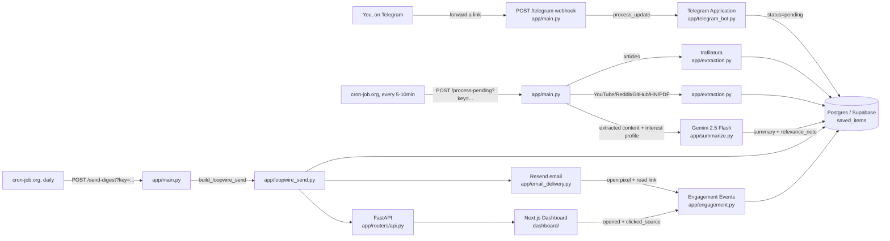

# Loopwire

**Your saved links, wired back to you as a dispatch.**

Saved links pile up and never get revisited — the bookmark graveyard problem.
Loopwire turns that into a daily habit: forward any article or YouTube link to
a Telegram bot, it extracts and summarizes the content, ranks it against what
you've actually engaged with (not just what you said you're interested in),
and sends you a dispatch — by email and on a web dashboard — that explains
what each item is and why it matters to you.

**A reading digest that learns what you actually read, not what you said
you'd read.** Multi-tenant (Google sign-in, one account per person) with
adaptive ranking built on real engagement data - see the
[Phase B](#phase-b-adaptive-personalization-the-actual-differentiator) section
below for exactly how, and its honest limits.

Built end-to-end from a phased PRD (v1: ingestion through delivery; v2:
multi-tenant + adaptive personalization) - the source briefs aren't included
in this repo, but every decision they drove is documented in the sections
below.


---

## What it does

1. **Sign in** — Google sign-in, one account per person. Your data is yours alone; see [Phase A](#phase-a-multi-tenant--auth).
2. **Ingest** — forward any link to your Telegram bot (once linked to your account). It's saved instantly, no setup per-link.
3. **Extract** — an on-demand pass (triggered every 5-10 min, no always-on process needed) pulls clean article text (`trafilatura`) or video transcripts (`youtube-transcript-api`) automatically.
4. **Summarize** — Gemini 2.5 Flash writes a grounded 2-3 sentence summary — never padded, never hallucinated. If extraction failed or came back thin, that's shown honestly instead of a made-up summary.
5. **Rank & explain** — items are ordered by similarity to what you've actually opened and clicked through before (not a static bio), with a relevance note that names the specific past item it's similar to once there's enough history — see [Phase B](#phase-b-adaptive-personalization-the-actual-differentiator).
6. **Deliver** — once a day (configurable), everything ranked since your last dispatch is bundled and sent by email *and* posted to your web dashboard.
7. **Log engagement** — every dispatch item's opens and click-throughs are recorded, which is exactly the data Phase B's ranking is built on - not a separate future step anymore.

## Screenshots

| Dashboard (web) | Email (Resend) |
|---|---|
|  |  |

| Engagement stats (`/signal`) |
|---|
|  |

The email screenshot shows both cases honestly: successfully summarized
items, and items that couldn't be processed (paywall, missing captions, or
an unsupported source like a social post or playlist) — each flagged with
the *actual* reason, never silently dropped or guessed at.

## Real example: generated summary vs. source

This is genuine pipeline output — not a written-for-the-README example —
generated by the real Gemini call against the real extracted article text.

> **Source:** [How to Do Great Work](https://www.paulgraham.com/greatwork.html) (11,826 words extracted)
>
> **Generated summary:** This article outlines a comprehensive approach to doing great work, emphasizing the importance of choosing a field based on natural aptitude and deep interest, then learning enough to reach the frontier of knowledge. It advises noticing and exploring gaps in existing knowledge, working hard on excitingly ambitious projects, and maintaining consistency over time. Key principles include optimizing for interestingness, cultivating a high taste for quality, being earnest and intellectually honest, and embracing elegance and simplicity in one's creations.
>
> **Relevance note:** This content offers practical advice on how to approach ambitious projects and personal development, aligning with the user's interest in product building and practical productivity/personal systems.
>
> **Estimated read time:** 15 min

Regenerate this against any URL yourself: `uv run python scripts/demo_summary.py <url>` (needs `GEMINI_API_KEY`).

## Daily usage

**Adding items**: forward any message containing a link to your bot (or just
paste the URL directly). You get an instant reply confirming it was saved;
a cron-triggered pass (every 5-10 min, see [SETUP.md](SETUP.md)) picks it up
and extracts + summarizes it automatically — no further action needed.
Unsupported sources (social posts, playlists) are saved too and show up
later as a raw link, just without a summary. Check on anything anytime on
the dashboard's **Wire** page (`/wire` - every link ever saved, live status,
whether or not it's been sent yet) or via `/list` in Telegram.

**Telegram commands**:

| Command | What it does |
|---|---|
| `/list` | Last 10 saved items + status (⏳ pending, 📄 extracted, ⚠️ extraction failed, ✅ summarized, 📬 sent) |
| `/profile` | Shows the current interest profile text |
| `/setprofile <text>` | Replaces the interest profile with whatever text follows — a plain-English description of your interests, never a link |
| `/stats` | Engagement rates (opened/clicked/skipped) by content type |

**Getting your dispatch**: a scheduled cron job (cron-job.org, free - see
[SETUP.md](SETUP.md)) pings `POST /send-digest?key=<secret>` on whatever
schedule you set, which builds and emails the dispatch and also wakes the
Render free-tier service up if it had spun down. To force one immediately:
`curl -X POST "http://localhost:8000/send-digest?key=<SEND_LOOPWIRE_SECRET>"`.

## Phase A: Multi-tenant + auth

Every table (`saved_items`, `loopwire_sends`, `engagement_events`) is scoped
to a `user_id`. Google sign-in (NextAuth v5) handles auth entirely on the
Next.js side; it never touches the database directly. Since every call to
the backend already happens in server-side code that's already validated the
session, the bridge to FastAPI is a shared secret + explicit user id header
pair (`X-Internal-Secret` / `X-User-Id`) rather than a signed JWT - simpler,
and there's nothing for a browser to ever see or forge.

- **Telegram linking**: after signing in, generate a short-lived code on the
  Settings page and send `/connect <code>` to the bot to link your chat.
  Unlinked chats get a sign-up prompt instead of silently saving links.
- **Per-user caps**: 10 saved links/day and 1 dispatch/day, both enforced
  with a clear rejection message (not a silent drop) - protects the shared
  free-tier Gemini/Resend quota from one account exhausting it for everyone.
- **Data isolation**: every query is filtered by the authenticated user's id;
  verified with two separate accounts seeing zero overlap in their own Wire/
  Log/Signal views.

## Phase B: Adaptive personalization (the actual differentiator)

A static "tell me your interests once" profile is what every basic
AI-summarizer tool does - Loopwire additionally ranks your dispatch by what
you've actually opened and clicked through, computed from real engagement
data rather than a bio you wrote once and never updated.

**How it actually works:**

1. Every summarized item gets embedded (`gemini-embedding-001`, truncated to
   768 dimensions) and the vector is stored alongside it - no separate
   vector database, just a Postgres array column and cosine similarity
   computed in Python (fine at personal-project scale).
2. Before each dispatch is built, your **interest vector** is recomputed as
   a weighted average of the embeddings of items you've engaged with:
   clicking through to the source counts double, opening without clicking
   counts once, and an inferred skip is *subtracted* - so a topic you
   consistently skip actively pulls the ranking away from it, not just gets
   ignored.
3. Pending items are ranked by cosine similarity to that vector, highest
   affinity first - not chronological order.
4. If a new item is strongly similar (≥ 0.82 cosine similarity) to something
   you've previously engaged with, the relevance note is regenerated to name
   that item directly (*"Similar to 'How to Do Great Work', which you read
   recently"*) instead of guessing from a static bio.

**The cold-start rule, honestly stated**: below **15 total engagement
events**, a computed vector is too noisy to trust, so ranking falls back to
an embedding of your static interest profile text instead (same one from
Settings/`/setprofile`). The dashboard and email footer both show exactly
where you stand - *"Static digest · 4/15 interactions until digests adapt to
you"* or *"Adaptive digest active"* once you clear it. This means **Loopwire
is deliberately unremarkable on day one** - it gets sharper the more you use
it, it does not arrive personalized out of the box, and that's by design
rather than an oversight.

**Verified, not just implemented**: `backend/tests/test_personalization_live.py`
creates a throwaway account, simulates 20 real engagement events with a
clear topical split (AI/ML content engaged with, unrelated content skipped),
and confirms a new AI-related item ranks above a new unrelated one - real run
scored 0.87 vs. 0.73 cosine similarity, a clear, legible gap. Cold-start
fallback was separately verified for a fresh account both with and without a
static profile set.

## Architecture



**Ingestion → extraction → summarization → delivery**, plus an engagement
logging path that runs alongside delivery (email open pixel, dashboard view,
click-through redirect) so future personalization has real data to work with.
Every step that used to need an always-on process is now HTTP-triggered
instead: Telegram pushes to a webhook, and two free cron-job.org jobs drive
processing and delivery. The entire backend is one Render web service, no
background worker, no paid tier - see [SETUP.md](SETUP.md) for the webhook +
both cron setups.

## Tech stack

| Layer | Choice | Why |
|---|---|---|
| Backend | Python 3.12, FastAPI, SQLAlchemy | simple, typed, one process serves the dashboard API, the Telegram webhook, and both on-demand endpoints |
| Database | Postgres (Supabase free tier) | hosted, web-accessible, no local DB to manage |
| Ingestion | Telegram Bot API (`python-telegram-bot`, webhook mode) | no always-on process - Telegram pushes updates to `/telegram-webhook`, fits Render's free web-service tier |
| Processing | External cron (cron-job.org, free) pinging `/process-pending` every 5-10 min | replaces an always-on polling worker, which would've needed Render's paid background-worker tier |
| Scheduling | External cron (cron-job.org, free) pinging `/send-digest` | a free-tier service can spin down when idle - an in-process cron wouldn't reliably fire, an external ping both triggers the send and wakes it up |
| Extraction | `trafilatura` (articles), `youtube-transcript-api` + YouTube oEmbed, plus Reddit/GitHub/HN/PDF extractors | free, no auth, handle failure explicitly |
| Summarization | Gemini 2.5 Flash, structured JSON output | generous free tier, strong long-context handling |
| Personalization | `gemini-embedding-001` (768-dim), cosine similarity in Python | no dedicated vector DB needed at this scale (Postgres array column) |
| Auth | NextAuth v5 (Google), shared-secret bridge to FastAPI | Next.js already validates the session server-side before ever calling the backend - no JWT needed on either side |
| Email | Resend | simple API, verified-domain sending, free tier plenty for personal volume |
| Dashboard | Next.js 16 (App Router), Tailwind v4 | deploys free on Vercel, server components fetch fresh on every load |

## Getting started

See [SETUP.md](SETUP.md) for step-by-step credential setup (Supabase, Telegram
BotFather, Gemini API key, Resend + domain verification). Quickstart once
`backend/.env` is filled in:

```bash
cd backend
uv sync
uv run python -m app.init_db                        # one-time: create tables + seed interest profile
uv run uvicorn app.main:app --reload --port 8000     # API + Telegram webhook + /send-digest + /process-pending
```

```bash
cd dashboard
npm install
npm run dev                                          # http://localhost:3000
```

Everything - the Telegram bot, extraction/summarization, and dispatch
delivery - lives inside this single API process now, triggered by webhook or
HTTP calls rather than always-on loops (see [SETUP.md](SETUP.md) for
registering the webhook and both cron-job.org triggers, including local
testing via ngrok). There's no separate worker process to run.

## API reference

All endpoints are served by the FastAPI backend (`backend/app/main.py` +
`backend/app/routers/api.py`):

| Method | Path | What it does |
|---|---|---|
| `GET` | `/health` | liveness check |
| `POST` | `/telegram-webhook` | receives Telegram update payloads (registered automatically on startup); validates `X-Telegram-Bot-Api-Secret-Token` if `TELEGRAM_WEBHOOK_SECRET` is set |
| `POST` | `/process-pending?key=<secret>` | runs one extraction + summarization pass over pending items - meant to be pinged by an external cron every 5-10 min; requires `PROCESS_PENDING_SECRET` to match, fails closed if unset |
| `POST` | `/send-digest?key=<secret>` | build + send a dispatch on demand - meant to be pinged by an external cron (cron-job.org) daily; requires `SEND_LOOPWIRE_SECRET` to match, fails closed if unset |
| `GET` | `/api/loopwire-sends/latest` | most recent dispatch + its items |
| `GET` | `/api/loopwire-sends` | history of all past dispatches (summary only) |
| `GET` | `/api/loopwire-sends/{id}` | one specific dispatch + its items |
| `GET` | `/api/items?status=` | every saved item this user ever forwarded, optionally filtered (`pending`/`extraction_failed`/`summarized`/`sent`) - powers the Wire page |
| `GET` | `/api/stats` | engagement rates by content type, this user only |
| `GET` | `/api/interest-profile` / `PUT` | view or update the static (cold-start fallback) interest profile |
| `GET` | `/api/profile-status` | engagement event count + the 15-event cold-start threshold + whether adaptive ranking is active - powers the dashboard badge |
| `GET` | `/api/me` | the signed-in user's own record (email, Telegram link status, profile text) |
| `POST` | `/api/connect-code` | generates a short-lived code for linking Telegram via `/connect <code>` |
| `POST` | `/api/auth/upsert-user` | internal-secret-only (no user id yet) - creates/fetches the Postgres user row on first Google sign-in |
| `POST` | `/api/items/{id}/opened` | log an "opened" engagement event (called by the dashboard on view) |
| `GET` | `/r/{id}` | click-through redirect to the original source; logs a "clicked_source" event; public/unauthenticated since email clients can't send custom headers |
| `GET` | `/track/opened/{id}.png` | 1x1 tracking pixel embedded in emails; logs an "opened" event |

All `/api/*` routes above (except `upsert-user`) require the internal auth
bridge (`X-Internal-Secret` + `X-User-Id` headers) and are scoped to that
user - see [Phase A](#phase-a-multi-tenant--auth).

## Project structure

```
backend/app/
  telegram_bot.py     Phase 1 — build_application() + handlers; /connect linking; runs via webhook (main.py) or standalone polling (local dev)
  extraction.py        Phase 2 — extract_article, extract_youtube, + reddit/github/hn/pdf extractors
  worker.py            Phase 2/3 — run_process_pending_cycle() + per-item embedding computation + extraction-failure Telegram notice
  summarize.py         Phase 3 — grounded structured summarization + Phase B grounded relevance-note generation
  embeddings.py         Phase B — compute_embedding, cosine_similarity (gemini-embedding-001)
  personalization.py    Phase B — interest vector computation, cold-start rule, similarity ranking
  loopwire_send.py     Phase 4/B — build_loopwire_send (per-user, ranked, cold-start aware), shared by email + web
  email_delivery.py    Phase 4/B — Resend HTML + plain-text email, cold-start footer note
  scheduler.py         Phase 4 — optional in-process APScheduler cron (not wired up by default, see main.py)
  engagement.py        Phase 5 — opened/clicked_source/skipped logging + stats, per-user
  auth.py               Phase A — internal-secret + X-User-Id verification bridge from the dashboard
  routers/api.py       dashboard-facing REST API, every route scoped to the authenticated user
  main.py              FastAPI app: /telegram-webhook, /process-pending, /send-digest, /r/{id} redirect, /track/opened/{id}.png pixel, Telegram Application lifecycle
  config.py            typed settings, reads backend/.env — never hardcode secrets here
  models.py            SQLAlchemy models: User, ConnectionCode, SavedItem, LoopwireSend, EngagementEvent — all user_id-scoped
dashboard/
  auth.ts               Phase A — NextAuth v5 config: Google provider, JWT session, upsert-user bridge
  proxy.ts               Phase A — route protection, redirects signed-out visitors to /signin
  app/signin/page.tsx    Phase A — branded "Continue with Google" page
  app/settings/page.tsx  Phase A — interest profile editor + Telegram connection code generator
  app/page.tsx          latest dispatch
  app/wire/             every saved link, live status (not just already-sent ones)
  app/log/              dispatch history
  app/signal/           engagement stats
  components/ItemSlip.tsx  the signature "transmission slip" card
  components/WireRow.tsx  dense status-ledger row for the Wire page
  components/ProfileStatusBadge.tsx  Phase B — cold-start progress / adaptive-active indicator
scripts/demo_summary.py  regenerate a real summary example against any URL
backend/tests/test_extraction_live.py  extraction acceptance test against 10 real URLs
backend/tests/test_personalization_live.py  Phase B ranking acceptance test (20 engagement events, real embeddings, asserts correct reordering)
```

## Verification

This was tested against real services, not just unit-level mocks:

- **Extraction** (`backend/tests/test_extraction_live.py`): 10/10 live test cases matched expectations across articles (normal, paywalled, dead link) and YouTube (normal, no-captions, invalid ID) — failures are correctly flagged, never silently returned as thin/garbage content.
- **Full pipeline, live**: real links forwarded via Telegram → extracted → summarized by a real Gemini call → bundled into a dispatch → sent via a real Resend email → rendered on the dashboard. Verified end-to-end multiple times during development, including edge cases (unsupported sources, no-captions videos) surfaced by manual testing.
- **Webhook mode**: verified locally with ngrok - registered a real HTTPS webhook, confirmed via `getWebhookInfo`, sent a live update through the public tunnel, and confirmed the resulting `saved_items` row and Telegram reply. `/telegram-webhook`, `/send-digest`, and `/process-pending` auth (missing/wrong secret → 401, correct secret → 200) all tested directly.
- **Dashboard**: built with a deliberate visual identity (see the "transmission slip" design in `dashboard/app/globals.css`), verified in-browser at desktop and mobile widths, zero console errors.
- **Multi-tenancy (Phase A)**: tested with a real account plus a second simulated account - confirmed zero data leakage (each account's Wire/Log/Latest/stats show only their own rows), confirmed `/connect <code>` correctly links a Telegram chat to the account that generated the code, confirmed the 10-links/day cap rejects the 11th forwarded link with a clear message while leaving the other account unaffected, confirmed the 1-send/day cap blocks a second `/send-digest` for an account that already received one that UTC day.
- **Adaptive ranking (Phase B)**: `backend/tests/test_personalization_live.py` builds 20 real engagement events with a deliberate topical pattern (10 AI/ML items clicked/opened, 10 unrelated items skipped), computes a real interest vector via `gemini-embedding-001`, and ranks two brand-new candidate items — the AI-related one scored 0.8712 against the unrelated one's 0.7335, correctly ranking first despite being listed second in the input. Cold-start fallback was verified separately for both a user with a static profile and a user with neither profile nor history.

## Deployment

- **Backend**: `backend/render.yaml` defines a single Render Blueprint web service, `loopwire-api` - the FastAPI app serving the dashboard API, the Telegram webhook, `/send-digest`, and `/process-pending`. There's no separate bot or worker service; everything Telegram- and processing-related lives inside this one process, driven by webhook pushes and external cron pings rather than always-on loops - that's what lets the whole thing run on Render's free tier. Full step-by-step: [SETUP.md](SETUP.md) section 8.
- **Dashboard**: Next.js on Vercel - not fully zero-config since Phase A, since it needs `NEXT_PUBLIC_BACKEND_URL`, `AUTH_SECRET`, `AUTH_GOOGLE_ID`/`AUTH_GOOGLE_SECRET`, and `INTERNAL_AUTH_SECRET` (must exactly match the backend's) set before the first deploy, and its **Root Directory** set to `dashboard` since this is a monorepo. Full step-by-step: [SETUP.md](SETUP.md) section 9.
- **Google OAuth**: the Google Cloud Console client used for local dev also needs the production Vercel URL added as an authorized origin + redirect URI, or sign-in fails with `redirect_uri_mismatch`. See [SETUP.md](SETUP.md) section 10.
- After both are deployed: register the webhook and both cron triggers - see [SETUP.md](SETUP.md) sections 5-7 (webhook registers itself on startup once `BACKEND_BASE_URL` is set correctly; cron-job.org needs a one-time setup pointed at `/send-digest` and `/process-pending`).
- Railway works the same way for the backend — create one service from the same repo with the same start command, no separate config file needed.

## Definition of done

- [x] Forwarding a link to Telegram reliably saves it (`/list` confirms status)
- [x] Article + YouTube extraction both work with visible failure states (10/10 live test cases)
- [x] Summaries are grounded and manually verified against source — verified live with a real `GEMINI_API_KEY`, no invented facts, no padding beyond what the source supports (see the real example above)
- [x] Email + web dashboard both deliver real content (verified end-to-end: send build → real Resend email → dashboard render → click-through → engagement stats)
- [x] Engagement events are logged for every sent item (opened via pixel/view, clicked_source via redirect, skipped inferred after one cycle)
- [ ] Deployed (not localhost) — `backend/render.yaml` blueprint is ready; Vercel deploy is zero-config once `NEXT_PUBLIC_BACKEND_URL` is set. Not yet pushed to production hosting.
- [x] Two or more Google accounts tested end-to-end with zero data leakage between them (Wire, Log, Latest, stats all correctly scoped)
- [x] Telegram account-linking (`/connect <code>`) works and routes each chat's forwarded links to the correct account
- [x] Per-user daily caps enforced and verified at the boundary (11th link/day rejected, 2nd send/day blocked)
- [x] Adaptive ranking demonstrably changes item order based on real engagement history (0.87 vs 0.73 cosine similarity, correct reordering — see Verification above)
- [x] Cold-start fallback behaves sensibly with no history (falls back to the static profile text, or a generic default if that's also blank — never a broken or empty ranking)
- [x] README explains the adaptive personalization mechanism honestly — what data it uses, the cold-start threshold, and that it improves with usage rather than being perfect on day one (see Phase B above)
- [x] Landing/sign-in page sets expectations up front (extraction can fail on paywalled/caption-less sources, connect Telegram after signing in)

## Limitations (honest, on purpose)

- **Adaptive ranking needs 15 engagement events to kick in.** Before that,
  every account rides on the static interest profile - see the
  [Phase B](#phase-b-adaptive-personalization-the-actual-differentiator)
  section above. This is a deliberate design choice (a noisy vector from 2-3
  events would rank worse than no ranking at all), not a bug, but it does
  mean the product is genuinely unremarkable for the first few days of use.
- **Embeddings are stored as a plain Postgres array column**, not a
  dedicated vector database or `pgvector` - cosine similarity is computed in
  Python at send-build time. Fine at personal/small-group scale; would need
  revisiting well before hundreds of users or tens of thousands of items.
- **Grounded relevance notes need a strong match (≥ 0.82 cosine similarity)**
  to a past-engaged item, or they fall back to the original static-bio note.
  That threshold was picked from one real test run, not tuned against a
  large sample - it may need adjusting as real usage accumulates.
- **Extraction is best-effort.** Paywalled articles (Medium, most news sites)
  and captionless videos are correctly flagged as `extraction_failed` rather
  than guessed at, but that means some forwarded links will only ever show up
  as a raw link in your dispatch.
- **New sending domains land in spam initially.** Even with SPF/DKIM/DMARC
  correctly configured, a brand-new domain has no sender reputation — the
  first several emails may land in spam until the recipient marks them as
  legitimate. This is inherent to email delivery, not a code issue.
- **Email tracking pixel** only fires if the recipient's mail client loads
  remote images (common default in Gmail, not universal) — click-through
  tracking via `/r/{id}` is the more reliable signal of the two.
