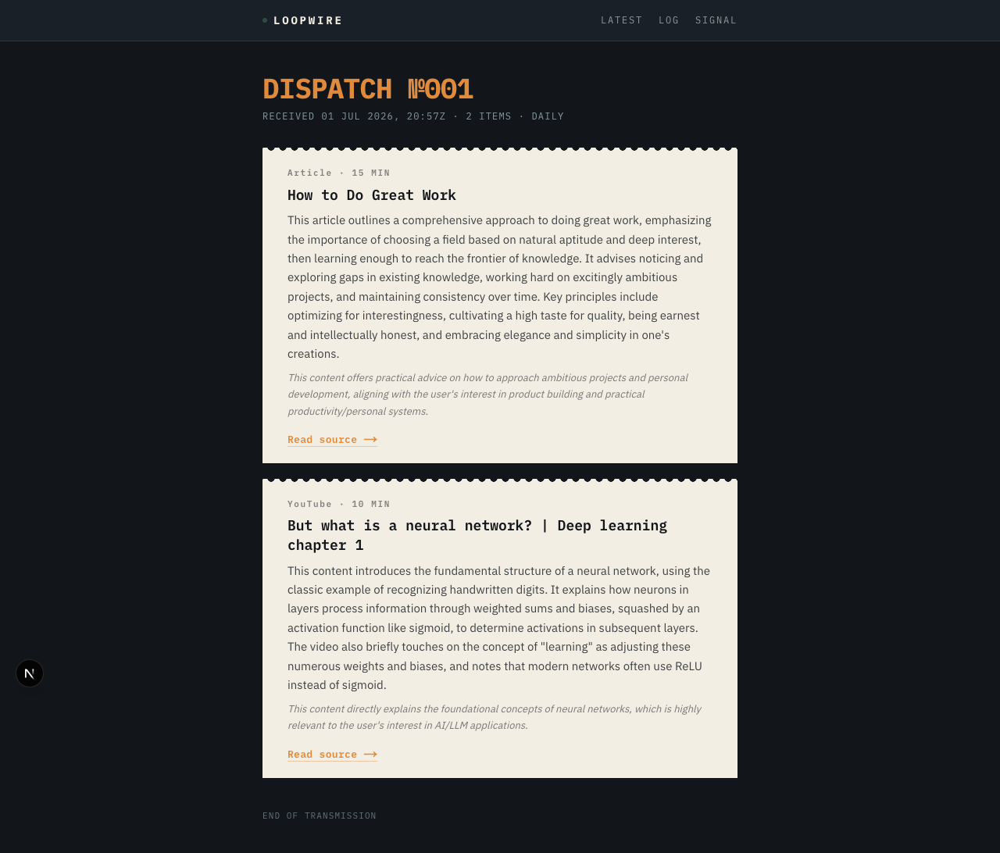
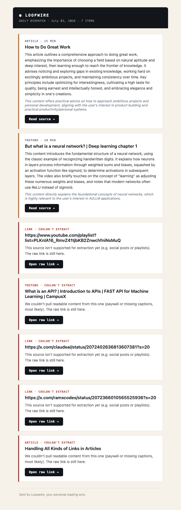
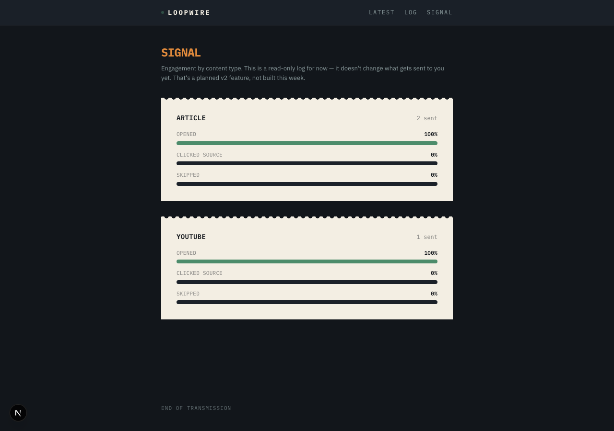
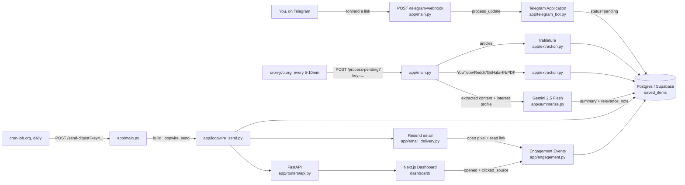

# Loopwire

**Your saved links, wired back to you as a dispatch.**

Saved links pile up and never get revisited — the bookmark graveyard problem.
Loopwire forwards any article or YouTube link from Telegram through
extraction, Gemini summarization, and adaptive ranking based on what you've
actually opened and clicked (not just what you said you like), then delivers
it as a dispatch by email and on a web dashboard.

Multi-tenant (Google sign-in, one account per person) with real
engagement-based personalization — see [Phase B](#phase-b-adaptive-personalization-the-actual-differentiator)
for the mechanism and its honest limits. Built from a phased PRD (v1:
ingestion → delivery, v2: multi-tenant + personalization); the source briefs
aren't in this repo, but every decision they drove is documented below.



## Contents

- [What it does](#what-it-does)
- [Screenshots](#screenshots)
- [Real example](#real-example)
- [Quickstart](#quickstart)
- [Daily usage](#daily-usage)
- [Phase A: Multi-tenant + auth](#phase-a-multi-tenant--auth)
- [Phase B: Adaptive personalization](#phase-b-adaptive-personalization-the-actual-differentiator)
- [Architecture](#architecture)
- [Tech stack](#tech-stack)
- [API reference](#api-reference)
- [Project structure](#project-structure)
- [Verification](#verification)
- [Deployment](#deployment)
- [Contributing](#contributing)
- [Limitations](#limitations-honest-on-purpose)

## What it does

1. **Sign in** — Google sign-in, one account per person. Your data is yours alone; see [Phase A](#phase-a-multi-tenant--auth).
2. **Ingest** — forward any link to your Telegram bot (once linked to your account). Saved instantly, no per-link setup.
3. **Extract** — an on-demand pass (every 5-10 min, no always-on process) pulls clean article text (`trafilatura`) or video transcripts (`youtube-transcript-api`).
4. **Summarize** — Gemini 2.5 Flash writes a grounded 2-3 sentence summary — never padded, never hallucinated. Failed/thin extractions are shown honestly instead of a made-up summary.
5. **Rank & explain** — items are ordered by similarity to what you've actually opened and clicked (not a static bio), with a relevance note naming the specific past item it resembles once there's enough history — see [Phase B](#phase-b-adaptive-personalization-the-actual-differentiator).
6. **Deliver** — once a day (configurable), everything ranked since your last dispatch is bundled and sent by email *and* posted to your web dashboard.
7. **Log engagement** — every dispatch item's opens and click-throughs are recorded — the data Phase B's ranking runs on.

## Screenshots

| Dashboard (web) | Email (Resend) |
|---|---|
|  |  |

| Engagement stats (`/signal`) |
|---|
|  |

The email screenshot shows both cases honestly: summarized items, and items
that couldn't be processed (paywall, missing captions, unsupported source) —
each flagged with the actual reason, never silently dropped or guessed at.

## Real example

Genuine pipeline output — not written for this README — generated by a real
Gemini call against real extracted article text.

> **Source:** [How to Do Great Work](https://www.paulgraham.com/greatwork.html) (11,826 words extracted)
>
> **Generated summary:** This article outlines a comprehensive approach to doing great work, emphasizing the importance of choosing a field based on natural aptitude and deep interest, then learning enough to reach the frontier of knowledge. It advises noticing and exploring gaps in existing knowledge, working hard on excitingly ambitious projects, and maintaining consistency over time. Key principles include optimizing for interestingness, cultivating a high taste for quality, being earnest and intellectually honest, and embracing elegance and simplicity in one's creations.
>
> **Relevance note:** This content offers practical advice on how to approach ambitious projects and personal development, aligning with the user's interest in product building and practical productivity/personal systems.
>
> **Estimated read time:** 15 min

Regenerate against any URL: `uv run python scripts/demo_summary.py <url>` (needs `GEMINI_API_KEY`).

## Quickstart

Full credential setup (Supabase, BotFather, Gemini, Resend) is in
[SETUP.md](SETUP.md). Once `backend/.env` and `dashboard/.env.local` are filled in:

```bash
cd backend
uv sync
uv run python -m app.init_db                        # one-time: create tables
uv run uvicorn app.main:app --reload --port 8000     # API + Telegram webhook + /send-digest + /process-pending
```

```bash
cd dashboard
npm install
npm run dev                                          # http://localhost:3000
```

Everything — Telegram bot, extraction/summarization, dispatch delivery —
lives inside this one API process, triggered by webhook or HTTP calls rather
than always-on loops. No separate worker process to run. See
[SETUP.md](SETUP.md) for registering the webhook and both cron-job.org
triggers (including local testing via ngrok).

## Daily usage

**Adding items**: forward any message containing a link to your bot (or
paste the URL directly). You get an instant reply confirming it was saved; a
cron-triggered pass (every 5-10 min) picks it up and extracts + summarizes it
automatically. Unsupported sources (social posts, playlists) are saved too
and show up later as a raw link, just without a summary. Check status
anytime on the dashboard's **Wire** page (`/wire`) or via `/list` in Telegram.

**Telegram commands**:

| Command | What it does |
|---|---|
| `/list` | Last 10 saved items + status (⏳ pending, 📄 extracted, ⚠️ extraction failed, ✅ summarized, 📬 sent) |
| `/profile` | Shows the current interest profile text |
| `/setprofile <text>` | Replaces the interest profile with a plain-English description of your interests — never a link |
| `/stats` | Engagement rates (opened/clicked/skipped) by content type |

**Getting your dispatch**: a scheduled cron job (cron-job.org, free) pings
`POST /send-digest?key=<secret>` on your chosen schedule, which builds and
emails the dispatch and wakes the Render free-tier service if it had spun
down. To force one immediately:
`curl -X POST "http://localhost:8000/send-digest?key=<SEND_LOOPWIRE_SECRET>"`.

## Phase A: Multi-tenant + auth

Every table (`saved_items`, `loopwire_sends`, `engagement_events`) is scoped
to a `user_id`. Google sign-in (NextAuth v5) happens entirely on the Next.js
side — the backend never talks to Google. Since every backend call already
comes from server-side code that's already validated the session, the bridge
to FastAPI is a shared secret + `X-User-Id` header pair, not a signed JWT —
simpler, and there's nothing for a browser to forge.

- **Telegram linking**: generate a short-lived code on the Settings page,
  send `/connect <code>` to the bot. Unlinked chats get a sign-up prompt
  instead of a silent save.
- **Per-user caps**: 10 saved links/day, 1 dispatch/day — enforced with a
  clear rejection message, protecting shared free-tier API quota from one
  account exhausting it for everyone.
- **Data isolation**: every query filters by the authenticated user's id;
  verified with two separate accounts seeing zero overlap.

## Phase B: Adaptive personalization (the actual differentiator)

A static "tell me your interests once" profile is what every basic
AI-summarizer does. Loopwire additionally ranks your dispatch by what you've
actually opened and clicked, computed from real engagement data rather than a
bio you wrote once and never updated.

**How it works:**

1. Every summarized item is embedded (`gemini-embedding-001`, truncated to
   768 dimensions) and stored alongside it — a Postgres array column plus
   cosine similarity in Python, no separate vector database.
2. Before each dispatch, an **interest vector** is recomputed as a weighted
   average of engaged items' embeddings: clicking through counts double,
   opening without clicking counts once, an inferred skip is *subtracted* —
   so a consistently-skipped topic actively pulls the ranking away, not just
   gets ignored.
3. Pending items are ranked by cosine similarity to that vector — highest
   affinity first, not chronological order.
4. If a new item is strongly similar (≥ 0.82 cosine similarity) to something
   you've engaged with before, its relevance note is regenerated to name that
   item directly (*"Similar to 'How to Do Great Work', which you read
   recently"*) instead of guessing from a static bio.

**Cold-start, honestly stated**: below **15 total engagement events**, a
computed vector is too noisy to trust, so ranking falls back to an embedding
of your static interest profile text (`/setprofile`). The dashboard and email
footer both show exactly where you stand — *"Static digest · 4/15
interactions until digests adapt to you"* or *"Adaptive digest active"* once
cleared. **Loopwire is deliberately unremarkable on day one** — it sharpens
with use rather than arriving personalized out of the box, by design.

Verified with a real test, not just implemented — see [Verification](#verification).

## Architecture



Ingestion → extraction → summarization → delivery, plus an engagement-logging
path that runs alongside delivery so Phase B's ranking has real data to work
with. Every step that used to need an always-on process is HTTP-triggered
instead: Telegram pushes to a webhook, and two free cron-job.org jobs drive
processing and delivery. The entire backend is one Render web service — no
background worker, no paid tier. See [SETUP.md](SETUP.md) for the webhook +
cron setup.

## Tech stack

| Layer | Choice | Why |
|---|---|---|
| Backend | Python 3.12, FastAPI, SQLAlchemy | one typed process serves the dashboard API, Telegram webhook, and both on-demand endpoints |
| Database | Postgres (Supabase free tier) | hosted, web-accessible, no local DB to manage |
| Ingestion | Telegram Bot API (`python-telegram-bot`, webhook mode) | no always-on process — Telegram pushes to `/telegram-webhook`, fits Render's free tier |
| Processing / Scheduling | External cron (cron-job.org, free) pinging `/process-pending` and `/send-digest` | replaces always-on polling/scheduling; a ping also wakes a spun-down free service |
| Extraction | `trafilatura` (articles), `youtube-transcript-api` + oEmbed, plus Reddit/GitHub/HN/PDF extractors | free, no auth, fail explicitly rather than guess |
| Summarization | Gemini 2.5 Flash, structured JSON output | generous free tier, strong long-context handling |
| Personalization | `gemini-embedding-001` (768-dim), cosine similarity in Python | no dedicated vector DB needed at this scale |
| Auth | NextAuth v5 (Google), shared-secret bridge to FastAPI | Next.js already validates the session server-side — no JWT needed either side |
| Email | Resend | simple API, verified-domain sending, free tier plenty for personal volume |
| Dashboard | Next.js 16 (App Router), Tailwind v4 | deploys free on Vercel, server components fetch fresh each load |

## API reference

Served by `backend/app/main.py` + `backend/app/routers/api.py`.

| Method | Path | What it does |
|---|---|---|
| `GET` | `/health` | liveness check |
| `POST` | `/telegram-webhook` | receives Telegram updates (registered automatically on startup); validates `X-Telegram-Bot-Api-Secret-Token` |
| `POST` | `/process-pending?key=<secret>` | one extraction + summarization pass over pending items — fails closed if `PROCESS_PENDING_SECRET` unset |
| `POST` | `/send-digest?key=<secret>` | build + send a dispatch on demand — fails closed if `SEND_LOOPWIRE_SECRET` unset |
| `GET` | `/api/loopwire-sends/latest` | most recent dispatch + its items |
| `GET` | `/api/loopwire-sends` | history of past dispatches (summary only) |
| `GET` | `/api/loopwire-sends/{id}` | one specific dispatch + its items |
| `GET` | `/api/items?status=` | every saved item this user forwarded, optionally filtered — powers the Wire page |
| `GET` | `/api/stats` | engagement rates by content type, this user only |
| `GET` / `PUT` | `/api/interest-profile` | view or update the static (cold-start fallback) interest profile |
| `GET` | `/api/profile-status` | engagement count + the 15-event threshold + whether adaptive ranking is active |
| `GET` | `/api/me` | the signed-in user's own record |
| `POST` | `/api/connect-code` | generates a short-lived code for linking Telegram via `/connect <code>` |
| `POST` | `/api/auth/upsert-user` | internal-secret-only — creates/fetches the Postgres user row on first sign-in |
| `POST` | `/api/items/{id}/opened` | logs an "opened" engagement event |
| `GET` | `/r/{id}` | click-through redirect to the source; logs "clicked_source"; public (email clients can't send custom headers) |
| `GET` | `/track/opened/{id}.png` | 1x1 tracking pixel embedded in emails; logs "opened" |

All `/api/*` routes above (except `upsert-user`) require the internal auth
bridge (`X-Internal-Secret` + `X-User-Id`) and are scoped to that user — see
[Phase A](#phase-a-multi-tenant--auth).

## Project structure

```
backend/app/
  telegram_bot.py       Phase 1 — build_application() + handlers; /connect linking; webhook or standalone polling
  extraction.py          Phase 2 — extract_article, extract_youtube, + reddit/github/hn/pdf extractors
  worker.py              Phase 2/3 — run_process_pending_cycle() + embedding computation + extraction-failure notice
  summarize.py           Phase 3 — grounded summarization + Phase B grounded relevance-note generation
  embeddings.py          Phase B — compute_embedding, cosine_similarity (gemini-embedding-001)
  personalization.py     Phase B — interest vector, cold-start rule, similarity ranking
  loopwire_send.py       Phase 4/B — build_loopwire_send (per-user, ranked, cold-start aware)
  email_delivery.py      Phase 4/B — Resend HTML + plain-text email, cold-start footer note
  scheduler.py           Phase 4 — optional in-process cron (not wired up by default)
  engagement.py          Phase 5 — opened/clicked_source/skipped logging + stats, per-user
  auth.py                Phase A — internal-secret + X-User-Id verification bridge
  routers/api.py         dashboard-facing REST API, scoped to the authenticated user
  main.py                FastAPI app: webhook, process-pending, send-digest, redirect, pixel, Telegram lifecycle
  config.py              typed settings, reads backend/.env
  models.py              User, ConnectionCode, SavedItem, LoopwireSend, EngagementEvent — all user_id-scoped
dashboard/
  auth.ts                Phase A — NextAuth v5 config: Google provider, JWT session, upsert-user bridge
  proxy.ts               Phase A — route protection, redirects signed-out visitors
  app/signin/page.tsx     Phase A — "Continue with Google" page
  app/settings/page.tsx   Phase A — interest profile editor + Telegram connection code generator
  app/page.tsx           latest dispatch
  app/wire/              every saved link, live status
  app/log/               dispatch history
  app/signal/            engagement stats
  components/ItemSlip.tsx  the "transmission slip" card
  components/WireRow.tsx  dense status-ledger row for the Wire page
  components/ProfileStatusBadge.tsx  Phase B — cold-start progress / adaptive-active indicator
scripts/demo_summary.py  regenerate a real summary example against any URL
backend/tests/test_extraction_live.py       extraction acceptance test against 10 real URLs
backend/tests/test_personalization_live.py  Phase B ranking acceptance test (20 engagement events, real embeddings)
```

## Verification

Tested against real services end-to-end, not mocks:

- [x] **Ingestion** — forwarding a link reliably saves it; `/list` confirms status.
- [x] **Extraction** — 10/10 live cases pass (`test_extraction_live.py`): articles (normal/paywalled/dead link), YouTube (normal/no-captions/invalid id) — failures flagged, never returned as thin content.
- [x] **Summarization** — grounded against real Gemini output, no invented facts (see [Real example](#real-example)).
- [x] **Delivery** — real Resend email + dashboard render + click-through, verified end-to-end repeatedly.
- [x] **Engagement logging** — opened (pixel/view), clicked_source (redirect), skipped (inferred) all logged for every sent item.
- [x] **Webhook mode** — verified locally with ngrok; `/telegram-webhook`, `/send-digest`, `/process-pending` auth tested directly (missing/wrong secret → 401).
- [x] **Multi-tenancy** — two accounts tested end-to-end with zero data leakage; Telegram linking, 10-link/day and 1-send/day caps verified at the boundary.
- [x] **Adaptive ranking** — `test_personalization_live.py`: 20 real engagement events, clear topical split; new AI-related item scored 0.87 vs. 0.73 for an unrelated item — correct reordering. Cold-start fallback verified with and without a static profile.
- [ ] **Deployed** — `render.yaml` + Vercel steps are ready (see [Deployment](#deployment)); not yet pushed to production hosting.

## Deployment

- **Backend**: `backend/render.yaml` is a single Render Blueprint web service — no separate bot or worker service, driven by webhook pushes and external cron pings so it fits Render's free tier. Steps: [SETUP.md](SETUP.md) §8.
- **Dashboard**: Next.js on Vercel — needs `NEXT_PUBLIC_BACKEND_URL`, `AUTH_SECRET`, `AUTH_GOOGLE_ID`/`AUTH_GOOGLE_SECRET`, `INTERNAL_AUTH_SECRET` (must match the backend's) set before first deploy, and **Root Directory** set to `dashboard`. Steps: [SETUP.md](SETUP.md) §9.
- **Google OAuth**: add the production Vercel URL as an authorized origin + redirect URI, or sign-in fails with `redirect_uri_mismatch`. Steps: [SETUP.md](SETUP.md) §10.
- After both are deployed: register the webhook and both cron triggers — [SETUP.md](SETUP.md) §5-7.
- Railway works the same way for the backend — same repo, same start command, no separate config file.

## Contributing

This started as a personal project, structured to stay easy to pick back up.

**Before you start**: get both services running locally via
[Quickstart](#quickstart) + [SETUP.md](SETUP.md), then skim
[Architecture](#architecture) and [Project structure](#project-structure) to
see where your change belongs.

**Making a change**:
- Backend (Python 3.12 / FastAPI): lint with `uvx ruff check app scripts` before committing.
- Dashboard (Next.js / TypeScript, strict mode): run `npm run lint` and `npx tsc --noEmit` before committing.
- Match the existing visual language (ink/paper/signal tokens in `dashboard/app/globals.css`) instead of introducing new colors ad hoc.
- Keep the honesty bar: if you touch extraction, summarization, or ranking, surface failures the way the rest of the codebase does (`extraction_failed` status, cold-start badge) — don't silently swallow them.

**Testing**: `backend/tests/test_extraction_live.py` and
`backend/tests/test_personalization_live.py` hit real external APIs and cost
quota, so they're not run on every commit — but re-run them if you touch
extraction, summarization, embeddings, or ranking, and update the numbers in
[Verification](#verification) if behavior changes. There's no CI yet, so a PR
description that says what you ran and what you saw matters more than a
green checkmark.

**Submitting**: open a PR against `main` with a short description of what
changed and why. Never commit `.env` / `.env.local` — both are gitignored;
check `git status` first if unsure.

## Limitations (honest, on purpose)

- **Adaptive ranking needs 15 engagement events to kick in.** Before that,
  every account rides on the static interest profile — see [Phase B](#phase-b-adaptive-personalization-the-actual-differentiator).
  Deliberate: a noisy vector from 2-3 events would rank worse than no
  ranking at all, but it does mean the product is unremarkable at first.
- **Embeddings are a plain Postgres array column**, not a dedicated vector
  database or `pgvector` — cosine similarity is computed in Python at
  send-build time. Fine at personal/small-group scale; revisit before
  hundreds of users or tens of thousands of items.
- **Grounded relevance notes need ≥ 0.82 cosine similarity** to a
  past-engaged item, or they fall back to the static-bio note. Picked from
  one real test run, not tuned against a large sample.
- **Extraction is best-effort.** Paywalled articles and captionless videos
  are correctly flagged as `extraction_failed` rather than guessed at, but
  some forwarded links will only ever show up as a raw link.
- **New sending domains land in spam initially.** Even with SPF/DKIM/DMARC
  configured, a brand-new domain has no sender reputation — inherent to
  email delivery, not a code issue.
- **The email tracking pixel** only fires if the recipient's client loads
  remote images (common but not universal) — click-through via `/r/{id}` is
  the more reliable signal.
